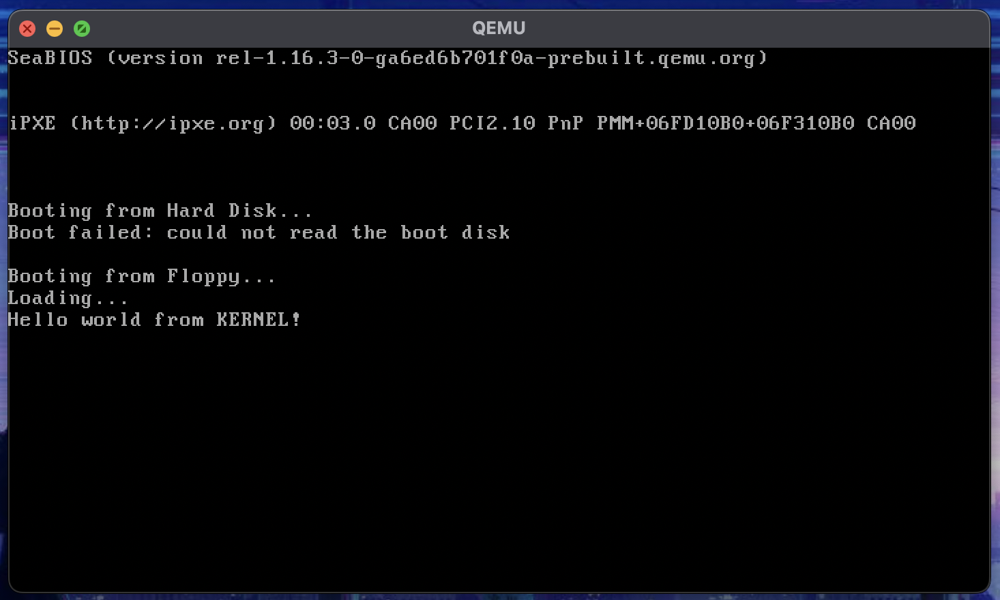

# IndieOS

An demo example Operating system written from scratch based on x86 Artitecture.

This repo is continuation of following repos' in my journey of learning how complex softwares are built:

- [OS Kernel Demo](https://github.com/Himasnhu-AT/OS-kernal-demo): Example implementation of OS kernel from scratch using `asm` and `c`. This include bootloader, bootsector, shell, ports, malloc's so on...

- [OS Basic Demo](https://github.com/Himasnhu-AT/OS-basic-Demo): scripts to build linux based OS as per LFS, BLFS ...

### Progress Tracker:

- [x] Bootloader
- [x] Bootsector
- [ ] Kernel
  - [x] Fat-12 Filesystem



> #### TODO: Update readme

> Packages Used:
>
> - brew install make
> - brew install nasm
> - brew install qemu
> - brew install dosfstools
> - brew install mtools

## Build and run the OS

```bash
make
qemu-system-i386 -fda build/main_floppy.img
```
